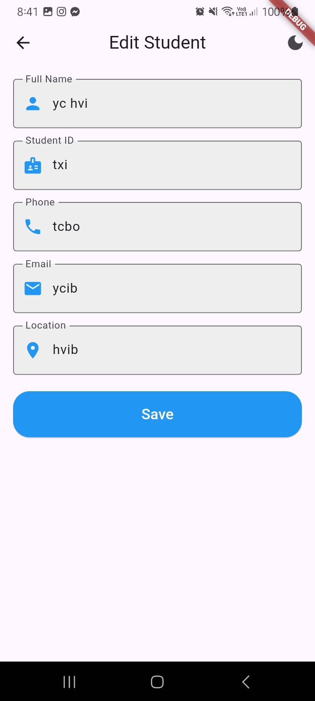

# Student Information System

This project is a simple Student Information System built using Flutter. It allows users to add, view, edit, and delete student records. The data is stored locally using SQLite.

## Features

* **Add Student:** Users can add new student records with details like name, student ID, phone number, email, and location.
* **View Students:** Users can view a list of all added students.
* **Edit Student:** Users can edit existing student records.
* **Delete Student:** Users can delete student records.
* **Local Storage:** Student data is stored locally using SQLite, ensuring persistence across app sessions.

## Screenshots

